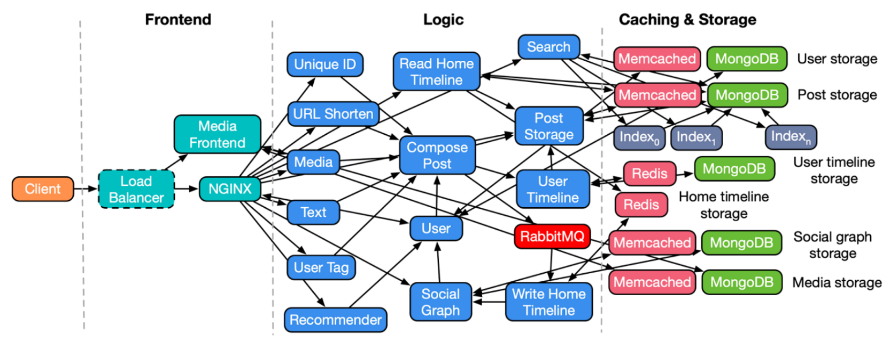
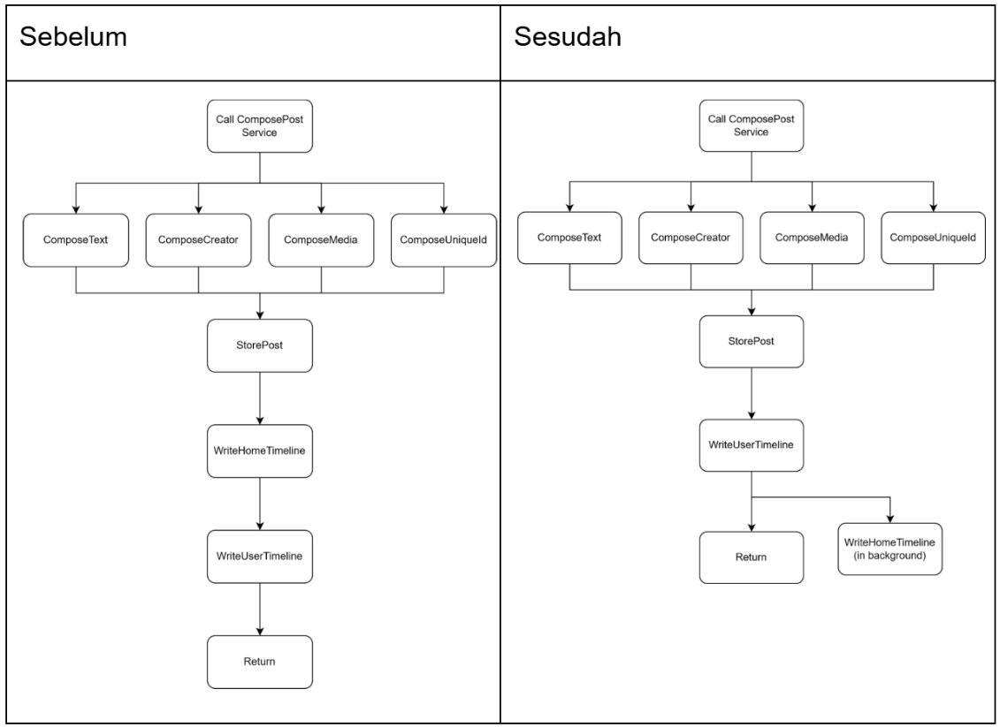
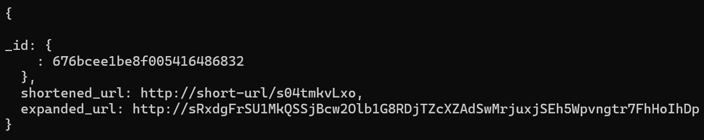

# Tugas Besar IF4031 Arsitektur Aplikasi Terdistribusi

## Analisis dan Optimisasi Aplikasi Social Network

### Sumber repository:

- https://github.com/delimitrou/DeathStarBench

### Anggota kelompok:

- 13521083 Moch. Sofyan Firdaus
- 13521091 Fakih Anugerah Pratama
- 13521170 Haziq Abiyyu Mahdy

### Cara menjalankan aplikasi

- [README.md](/socialNetwork/README.md)

---

## 1. Arsitektur Aplikasi Social Network

### a. **Frontend**

- **Media Frontend**: Menggunakan NGINX untuk menyediakan fitur pengunggahan dan pengunduhan file media (foto dan video) yang disimpan di MongoDB.
- **Web Server NGINX**: Menyediakan file statik (HTML, JS) dan bertindak sebagai API Gateway menggunakan script Lua untuk memanggil layanan pada logic layer.

### b. **Logic**

- Terdiri dari 14 layanan menggunakan Apache Thrift untuk RPC.
- Implementasi utama menggunakan C++ dengan fleksibilitas untuk menggunakan bahasa lain (Python, Java, Lua, dsb).

### c. **Caching & Storage**

- **Storage**: MongoDB untuk persistent storage.
- **Caching**: Redis dan Memcached untuk mempercepat akses data.

---

## 2. Lingkungan Eksperimen

- **Processor**: Intel Core i7-1195G7 @ 2.90GHz
- **RAM**: 32 GB
- **OS**: Windows 11 dengan WSL (Ubuntu) dan Docker Desktop.

---

## 3. Perencanaan Eksperimen

### Langkah-langkah:

1. Instalasi dependencies:
   - Docker
   - Docker Compose
   - Python 3.5+
   - libssl-dev
   - libz-dev
   - luarocks
   - luasocket.
2. Menjalankan aplikasi menggunakan `docker-compose`.
3. Mengisi data awal menggunakan `init_social_graph.py`.
4. Menjalankan beban kerja menggunakan **wrk2**.
5. Menganalisis trace dengan Jaeger dan struktur database menggunakan MongoDB Compass.

---

## 4. Analisis Hasil Eksperimen dan Solusi Pengembangan (selengkapnya di Dokumen Hasil Analisis dan Eksperimen)

### a. **Compose Post**

- **Masalah**: Bottleneck saat memasukkan post ke home timeline semua follower.
- **Solusi**: Melakukan penulisan home timeline secara asinkron (fire-and-forget).
- **Hasil**: Latensi berkurang dari 29.41ms menjadi 14.61ms.
  

### b. **Follow/Unfollow**

- **Masalah**: Redundansi pengambilan `user_id` melalui API pada proses Follow/Unfollow, meskipun sudah `user_id` sudah tersimpan di cookie
- **Solusi**: Menghilangkan pengambilan `user_id` melalui API dan mengambilnya dari cookie.
- **Hasil**: Latensi berkurang dari 11.88ms menjadi 9.83ms.

### c. **URL Shortener**

- **Masalah**: Penyimpanan short URL yang boros ruang karena prefix `http://short-url/` tetap disimpan, serta waktu lookup lambat.
- **Solusi (direkomendasikan)**: Hanya menyimpan ID dari short URL (tanpa prefix) pada database
- **Solusi**: Menggunakan hashed index pada MongoDB untuk URL lookup .
- **Hasil**: Latensi berkurang dari 1.91ms menjadi 1.82ms.

### d. **Media Storage**

- **Masalah**: Penyimpanan file media langsung di MongoDB menyebabkan I/O lambat.
- **Solusi (direkomendasikan)**: Memindahkan file media ke object storage (seperti AWS S3) dan menyimpan metadata di MongoDB.

---

## 4. Rekomendasi

- Memperbesar workload untuk melihat efek optimisasi
- Perhitungan latency yang lebih baik dengan mengulang workload beberapa kali dan mengambil waktu rata-rata

## Lampiran

- [Dokumen hasil analisis dan eksperimen (docs)](https://docs.google.com/document/d/1ZAyvqUyljCSxduFjd07ORriXxklhBaC0vOVTnv_-gmY/edit?usp=sharing)
- [Dokumen hasil analisis dan eksperimen (pdf)]()
